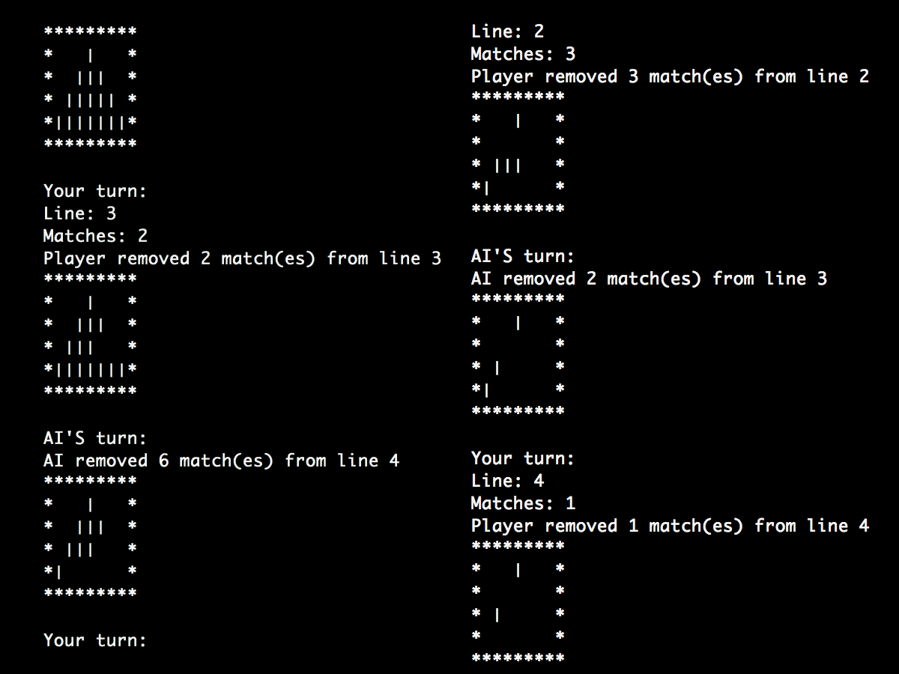

# Allum1

Création d'un algorithme imbattable sur le jeu de Marienbad

## Mise en route

Ces instructions vous permettront d'obtenir une copie du projet opérationnel sur votre machine locale à des fins de développement et de test.

### Pré-requis

De quoi avez-vous besoin pour installer le logiciel et comment l'installer ?

```
gcc
make
```

### Installation

Voici comment lancer le projet sur votre ordinateur:

Cloner et se placer dans le répertoire EPITECH-Allum1

Compilation du projet

```
make re
```

Lancement du projet

```
./allum1
```

## Captures d'écrans



## Construit avec

* [C](https://fr.wikipedia.org/wiki/C_(langage))

## Auteurs

* **Romain Deguerville** - [RoromiDev](https://github.com/RoromiDev)
